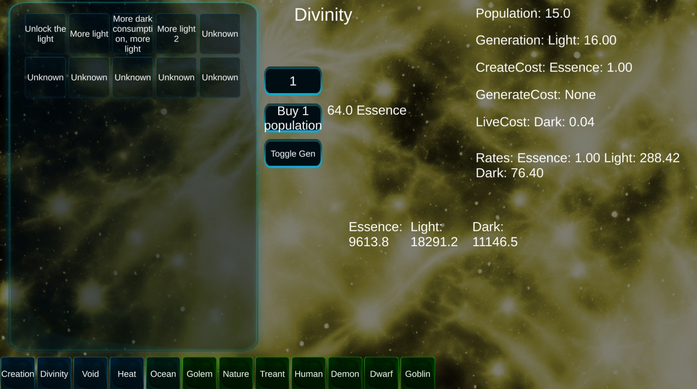
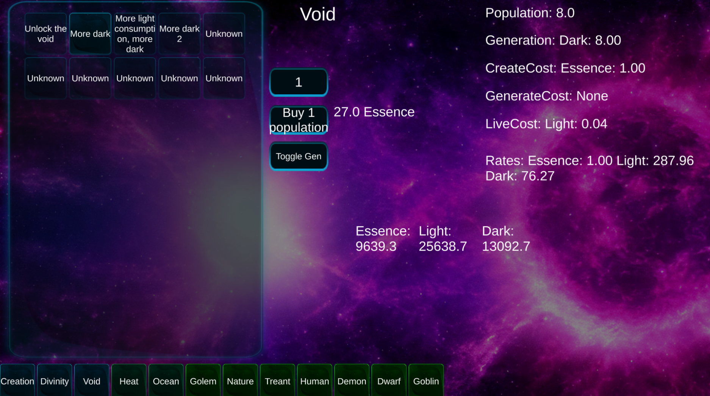

# Idle Factions

[Game build](https://chillu1.github.io/IdleFactionsWeb/)

Idle factions is a game based around 17+ factions, each with unique resource generation, and upgrades.
The main idea is that each run you choose one of two faction choices. Both of them using and generating mostly similar resources.
With this, and unique upgrades, you can create new builds each run.

This is partially inspired by Realm Grinder.

This project is on hold for two reasons:

- It's over-engineered and I tried to make it very statless, and applied ECS patterns without ECS.
- It's mostly only missing content, which is usually the least fun part of game dev for me.

## What's unfinished

- Prestige mechanics
- Content. All the systems and logic is in place, but the content itself like faction upgrades, progression, etc. is not.

## What's finished

- Factions
- Upgrades
- Progression
- Resource management
- Save/Load state (with JSON)
- Some unit tests
- Basic UI, hover panel
- Revert logic (undoing upgrades)

Most important data:
[Upgrades](https://github.com/Chillu1/IdleFactions/blob/a6bbfa4a343cf8d6681775ed6df979cb101fc75e/IdleFactions/Assets/Scripts/Core/Data/UpgradeData.cs)
and [Factions](https://github.com/Chillu1/IdleFactions/blob/a6bbfa4a343cf8d6681775ed6df979cb101fc75e/IdleFactions/Assets/Scripts/Core/Data/FactionData.cs)

## Future

I will be making a new game with the exact same core mechanics and principles in the future.
But instead I'll be using ECS and not over-complicate the codebase. Most likely in 2024.

## Design

Theorycrafting factions. More info in [Docs/*](https://github.com/Chillu1/IdleFactions/tree/master/Docs)

| Faction          | Generates       | NeededToCreate                                     | NeedsToLive   | NeedsToGenerate      |
|------------------|-----------------|----------------------------------------------------|---------------|----------------------|
| Divinity/Creator | Light           |                                                    |               |                      |
| Necro            | Skeletons       | Human, Energy, Dark, Skeleton?                     | Food, Mana    | Dark                 |
| Mage             | Mana            | Human, Energy, Light, Skeleton/Human?              | Food, ?       | Energy               |
| Human            | Food, Wood      | Plants, Light, Water, Skeleton?, Lifeforce/Energy? | Food, Water   | Plants               |
| Gobling/Ogre/w/e | Food, Stone     | Plants, Dark, Water, Skeleton?                     | Food, Water   |                      |
| Ocean            | Water           | Light                                              | Light         |                      |
| Warlock faction  | Magic/mana      | Human, ?                                           | Food, ?       |                      |
| Demons/Fire      | Heat/fire/light |                                                    | Light?        |                      |
| Nature           | Plants, Food-   |                                                    | Water, Light? | Light, Water         |
| Treant           | Wood            | Light, Plants, Water                               | Light, Water  | Water, Light         |
| Nature2?         | Wildlife        |                                                    | Light, Water  | Light, Water, Plants |
| Dwarf?           | Gold/treasures  |                                                    | Food          |                      |
| Void?Elders?	    | Dark            |                                                    |               | Light                |
| Evil?            | Souls/bodies    |                                                    | Dark          | Human                |
| Creation         | Energy/Essence  |                                                    |               |                      |
| Golem            | Stone           |                                                    | Human?,       |                      |
| Drowner          | Bodies          |                                                    | Water         | Human                |